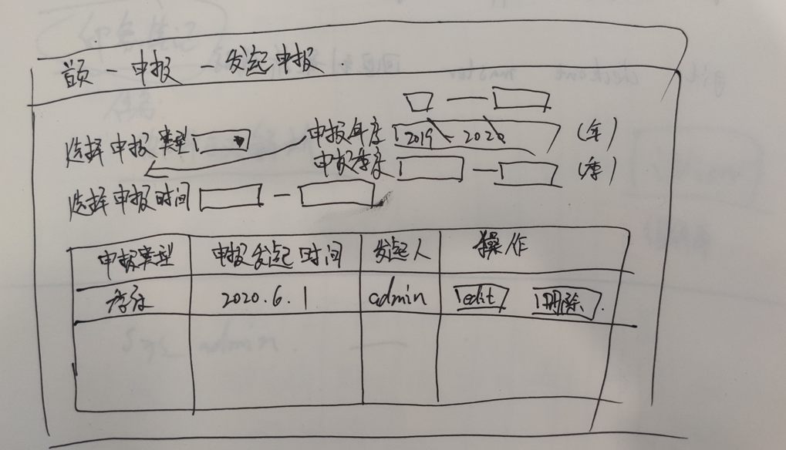
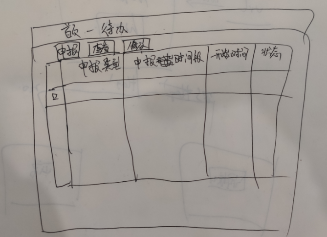

# document_project 设计文档


## login页面

- 点击登录 ， 后台判断账号密码是否正确，如果正确再判断是否有权限登录
- 如果没有注册过 ， 提示没该账号信息，请去注册
- 注册页面 ， 需要提供企业名称 ， 一个企业只能注册一个账号
- 如果账号没有通过审核进不了系统 
- 忘记密码——发送消息给管理员账户
- 如果该账户未注册，提醒该账号未注册是否注册登录
- 登录成功提示，已经发送审核请求给管理员


## 主页

- 申报

  - 申报时间设置（管理员权限）
  - 物流企业季度表申报
  - 物流企业年度表申报
  - 各企业申报状态（管理员权限）

- 基本信息

  - 企业基本情况表

- 各企业基本信息（管理员权限）

  


1. 所有表单填报人必须是已经审核通过的账号，那么刚刚注册但是并未通过审核的，可以写，但是不能提交，会提示还没有通过审核
2. 人工设定申报时间
   1. 在操作中，展示历史设定。
   2. 设定时间，操作历史中展示，并且可以编辑和删除
3. 申报 提交时判断是否在时间段内
4. 


申报进度表


发起申报



+ 发起申报之后，所有用户有一个提醒，并且在首页显示
+ 


待办




``` js
let util = {}

util.tableRowFormat = function (row, option) {
    if (option.type !== undefined) {
        if (option.type === 'date') {
            return row[option.key] ? util.timestampToDate(row[option.key]) : '-'
        } else if (option.type === 'datemonth') {
            return row[option.key] ? util.timestampToMonthDate(row[option.key]) : '-'
        } else if (option.type === 'datetime') {
            return row[option.key] ? util.timestampToDateTime(row[option.key]) : '-'
        } else if (option.type === 'format') {
            return option.format[row[option.key]]
        } else if (option.type === 'func') {
            return option.func(row, option.key)
        } else if (option.type === 'numCommas') {
            return this.formatNumberCommas(row[option.key])
        } else if (option.type === 'percent') {
            if (row[option.key] != null && row[option.key] !== '') {
                return row[option.key] + '%'
            } else {
                return ''
            }
        } else {
            return row[option.key]
        }
    } else {
        return row[option.key]
    }
}

export default util
```

