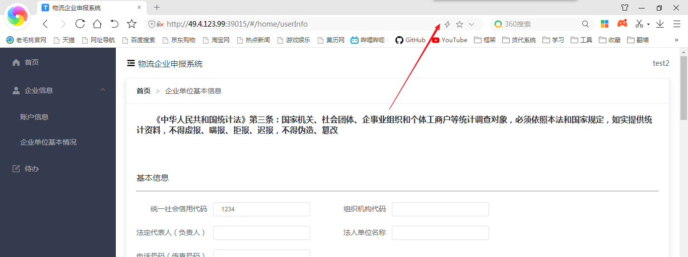
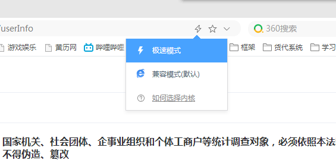
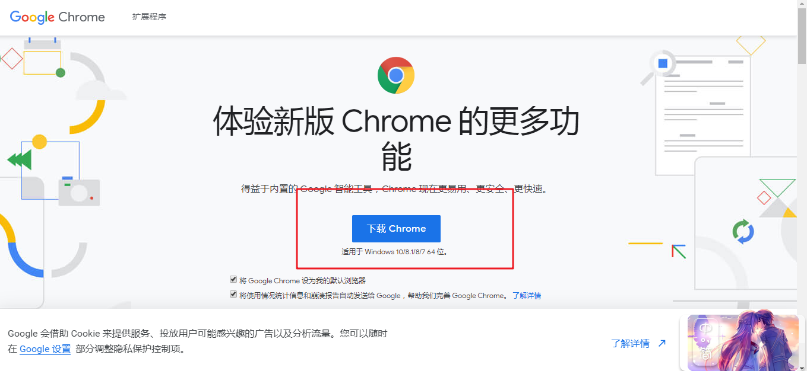

启动项目

``` cmd
npm i   // 安装依赖
```

``` cmd
npm run serve
```


# declare_admin_frontend 设计文档


## login页面

- 点击登录 ， 后台判断账号密码是否正确，如果正确再判断是否有权限登录
- 如果没有注册过 ， 提示没该账号信息，请去注册
- 注册页面 ， 需要提供企业名称 ， 一个企业只能注册一个账号
- 如果账号没有通过审核进不了系统 
- 忘记密码——发送消息给管理员账户
- 如果该账户未注册，提醒该账号未注册是否注册登录
- 登录成功提示，已经发送审核请求给管理员


## 主页

- 申报

  - 申报时间设置（管理员权限）
  - 物流企业季度表申报
  - 物流企业年度表申报
  - 各企业申报状态（管理员权限）

- 基本信息

  - 企业基本情况表

- 各企业基本信息（管理员权限）

  


1. 所有表单填报人必须是已经审核通过的账号，那么刚刚注册但是并未通过审核的，可以写，但是不能提交，会提示还没有通过审核
2. 人工设定申报时间
   1. 在操作中，展示历史设定。
   2. 设定时间，操作历史中展示，并且可以编辑和删除
3. 申报 提交时判断是否在时间段内


vue.config.js 配置


axios 基本设置


读取文件的方法


解析excel


# 接口需求

默认URL头 ： `baseURL = " http://192.168.1.111:8090 "`

> 接口顺序 ,  登录页面  =>     企业信息 =>   待办    =>      申报  =>  账号管理

## 登录页面

### 注册接口

| 项目        | 描述     |
| ----------- | -------- |
| 接口描述    | 点击注册 |
| HTTP Header |          |
| Method      |          |
| 请求参数    | data     |
| 请求地址    | /api/    |


``` js
// 请求参数
data {
    company: '',  //公司名称
    user: '',     //用户名
    password: '',  //密码 md5加密
    code: '',          // 验证码
    captchaIdentity: '' // 正确的验证码
}
// 返回数据
1. 成功
2. 失败 
3. 失败 该公司已注册过账号
```


### 登录接口

| 项目        | 描述     |
| ----------- | -------- |
| 接口描述    | 点击登录 |
| HTTP Header |          |
| Method      |          |
| 请求参数    | data     |
| 请求地址    | /api/    |

``` js
// 传参
data {
    user: '',     //用户名
    password: '',  //密码 md5加密
    code: '',          // 验证码
    captchaIdentity: '' // 正确的验证码
}
// 返回数据
data {
    token,
    refresh_token,
    routerList:[] // 该账号对应的路由有哪儿些 ， 格式如下
    <--!
        [
            {
                index: '/home',
                title: '首页',
                icon: 'el-icon-s-home'
            },
            {
                index: '1',
                title: '企业信息',
                icon: 'el-icon-s-custom'
                children: [
                    {
                        index: '/home/account',
                        title: '账户信息'
                    },
                    {
                        index: '/home/userInfo',
                        title: '企业单位基本情况'
                    }
                ]
            },
    ]
        
        -->
}
```

#### 路由的完整列表

``` js
    routes: [
        {
            index: '/home',
            title: '首页',
            icon: 'el-icon-s-home'
        },
        {
            index: '1',
            title: '企业信息',
            icon: 'el-icon-s-custom'
            children: [
                {
                    index: '/home/account',
                    title: '账户信息'
                },
                {
                    index: '/home/userInfo',
                    title: '企业单位基本情况'
                }
            ]
        },
        {
            index: '2',
            title: '申报'
            icon: 'el-icon-document',
            children: [
                {
                    index: '/home/declarationOperate',
                    title: '操作'
                },
                {
                    index: '/home/declarationSchedule',
                    title: '申报进度'
                }
            ]
        },
        {
            index: '3',
            title: '账号管理',
            icon: 'el-icon-user'
            children: [
                {
                    index: '/home/user/userAudit',
                    title: '账号审核'
                },
                {
                    index: '/home/user/userManage',
                    title: '账号列表'
                }
            ]
        },
        {
            index: '/home/todoCenter',
            title: '待办',
            icon: 'el-icon-edit-outline'
        }
    ]
```

#### 不同权限对应的路由展示

+ 所有人可以看到首页

+ 0 ， 未通过账号审核的 ， 路由为 `企业信息`

+ 1， 通过账号审核 ，也就是普通企业用户 ， 路由为 `企业信息` , `待办`

+ 2， 管理员 ， `申报`  ,  `账号管理`


## 用户信息接口

| 项目        | 描述                                         |
| ----------- | -------------------------------------------- |
| 接口描述    | 获取 用户的  公司    ，    账号 ， 头像URL等 |
| HTTP Header | Authorization:"`Bearer  token`"              |
| Method      |                                              |
| 请求参数    |                                              |
| 请求地址    | /api/                                        |

``` js
// 返回数据
data{
    id,
    company, // 公司
    user,  // 用户名
    photoUrl, // 用户头像URL
    auditStatus, // 账号是否通过审核 （0，未通过  1， 已通过）
}
```


## 企业单位基本情况接口

### 上传数据

| 项目        | 描述                            |
| ----------- | ------------------------------- |
| 接口描述    | 获取用户企业单位基本信息        |
| HTTP Header | Authorization:"`Bearer  token`" |
| Method      | post                            |
| 请求参数    | data                            |
| 请求地址    | /api/                           |

``` js
// 请求参数
data{
	form
}
```

#### 字段表

``` js
uscCode: '', // 统一社会信用代码
ifCode: '', // 组织机构代码
principalName: '', // 负责人
company: '', // 公司名
companyTel: '', // 公司名传真
address: '', // 详细地址
email: '', // 电子信箱
postalCode: '', // 邮政编码
operational: '', // 主要业务活动
industryCode: '', // 行业代码
openingTime: '', // 开业时间
companyLoginType: '', // 企业登记注册类型
login_total: '', // 登记注册资本合计
county_total: '', // 国家合计
collective_total: '', // 集体合计
legalPerson_total: '', // 法人合计
self_total: '', // 个人合计
HMT_total: '', // 港澳台合计
foreign_total: '', // 外商资本合计
// 基础设施
theirOwn: '', // 自有仓储面积
rent: '', // 租用仓储面积
handlingEquipment: '', // 装卸设备
railway: '', // 铁路专用线
logisticsSystem: '', // 物流计算机信息管理系统
transportVehicle: '', // 运输车辆
trucksCar: '', // 货车
selfTrucksCar: '', // 专用货车
chillCar: '', // 冷藏车
containerCar: '', // 集装箱专用车
dangerCar: '', // 危险品专用车辆
returnTime: '', // 报出日期
companyPrincipal: '', // 单位负责人
preparer: '', // 填表人
phone: '' // 电话
list:[]   // 为下面的list ， 为json格式
```

从业人员情况的数据写在一个table表格中

``` js
list: [
    {
        targets: '1.年末从业人员合计（人）',
        womanTotal: '',
        total: ''
    },
    {
        targets: '  #物流从业人员合计',
        womanTotal: '',
        total: ''
    },
    {
        targets: '2.从业人员劳动报酬（万元）',
        womanTotal: '',
        total: ''
    },
    {
        targets: '#管理人员劳动报酬（万元）',
        womanTotal: '',
        total: ''
    },
    {
        targets: '3.从业人员文化程序（人）',
        womanTotal: '',
        total: ''
    },
    {
        targets: '#研究生及以上学历人员',
        womanTotal: '',
        total: ''
    },
    {
        targets: '大学本科学历人员',
        womanTotal: '',
        total: ''
    },
    {
        targets: '大学专科学历',
        womanTotal: '',
        total: ''
    },
    {
        targets: '高中及以下',
        womanTotal: '',
        total: ''
    },
    {
        targets: '4.专业技术职称（人）',
        womanTotal: '',
        total: ''
    },
    {
        targets: '#高级技术职称人员',
        womanTotal: '',
        total: ''
    },
    {
        targets: '中级技术职称人员',
        womanTotal: '',
        total: ''
    },
    {
        targets: '初级技术职称人员',
        womanTotal: '',
        total: ''
    },
    {
        targets: '5.专业技术等级（人）',
        womanTotal: '',
        total: ''
    },
    {
        targets: '#高级技师',
        womanTotal: '',
        total: ''
    },
    {
        targets: '技师',
        womanTotal: '',
        total: ''
    },
    {
        targets: '高级工',
        womanTotal: '',
        total: ''
    },
    {
        targets: '中级工',
        womanTotal: '',
        total: ''
    }
]
```

### 获取数据

| 项目        | 描述                            |
| ----------- | ------------------------------- |
| 接口描述    | 获取用户企业单位基本信息        |
| HTTP Header | Authorization:"`Bearer  token`" |
| Method      |                                 |
| 请求参数    | id                              |
| 请求地址    | /api/                           |

``` js
// 返回数据

有数据
form：{}

没有数据：null
```


## 待办接口

### 获取管理员发布的申报列表

| 项目        | 描述                            |
| ----------- | ------------------------------- |
| 接口描述    | 获取管理员发布的申报列表        |
| HTTP Header | Authorization:"`Bearer  token`" |
| Method      |                                 |
| 请求参数    | page                            |
| 请求地址    | /api/                           |

``` js
// 请求参数
page:{
    currentPage ,  // 请求页码
    pageSize ，  // 显示条数
}

// 返回数据
data : {
    total: 100, // 总条数
    list：[
        {
            id , 
            originPerson , // 申报发起人 管理员
            declarationType , // 申报类型 （ quarter 为季度 ， year 为年度 ）
            declarationDate , // 申报起止日期
            declartionStartEndTime , // 申报周期
            declarationStatus ， // 申报状态 (0 未申报 ， 1  申报已提交 ， 2 审核完成 ， 3 申报超时)
        }
    ]
}
```


### 提交申报接口

| 项目        | 描述                            |
| ----------- | ------------------------------- |
| 接口描述    | 用户点击申报                    |
| HTTP Header | Authorization:"`Bearer  token`" |
| Method      |                                 |
| 请求参数    | data                            |
| 请求地址    | /api/                           |

``` js
// 请求参数
data :{
    declarationType,   // 申报类型
    list:[]    // 申报的数据  json格式
}
```

申报数据

``` js
[
    {
        targetName: '货运量',
        measureUnit: '吨',
        code: '01',
        current: '',
        YOY: ''
    },
    {
        targetName: '周转量',
        measureUnit: '吨公里',
        code: '02',
        current: '',
        YOY: ''
    },
    ......
]
```


## 申报

### 设置起止时间接口

| 项目        | 描述                            |
| ----------- | ------------------------------- |
| 接口描述    | 管理员设置一条申报              |
| HTTP Header | Authorization:"`Bearer  token`" |
| Method      |                                 |
| 请求参数    | data                            |
| 请求地址    | /api/                           |


``` js
// 请求参数
data : {
    declartionType , // 申报类型
    declartionStartEndTime ， // 报表周期
    declartionWriteTime， // 申报起止时间
}
```


### 获取管理员设定的申报历史列表接口

| 项目        | 描述                            |
| ----------- | ------------------------------- |
| 接口描述    | 获取管理员设定的申报历史列表    |
| HTTP Header | Authorization:"`Bearer  token`" |
| Method      |                                 |
| 请求参数    | page                            |
| 请求地址    | /api/                           |

``` js
// 请求参数
page:{
    currentPage ,  // 请求页码
    pageSize ，  // 显示条数
}

// 返回数据
ruturnData : {
    total: 100, // 总条数
	list:[
        	declarationType , // 申报类型
        	declartionStartEndTime ， // 报表周期
        	declartionWriteTime ， // 申报起止日期
        	declartionStatus ，  // 当前申报状态 '0': '申报未开始', '1': '申报正在进行中', '2': '申报已结束'
        	originPerson ， // 申报发起人
    ]
}
```


### 某一条申报进行修改的接口

| 项目        | 描述                            |
| ----------- | ------------------------------- |
| 接口描述    | 对申报进行修改                  |
| HTTP Header | Authorization:"`Bearer  token`" |
| Method      |                                 |
| 请求参数    | id                              |
| 请求地址    | /api/                           |

``` js
// 请求参数
data : {
    id,
    declartionType , // 申报类型
    declartionStartEndTime ， // 报表周期
    declartionWriteTime， // 申报起止时间
}
// 返回数据

```


### 某一条申报进行删除的接口 （逻辑删除）

| 项目        | 描述                            |
| ----------- | ------------------------------- |
| 接口描述    | 对申报进行删除                  |
| HTTP Header | Authorization:"`Bearer  token`" |
| Method      |                                 |
| 请求参数    | id                              |
| 请求地址    | /api/                           |


### 申报进度

#### 各单位申报进度列表接口

| 项目        | 描述                                       |
| ----------- | ------------------------------------------ |
| 接口描述    | 查看一条申报 ， 显示所有企业单位的申报情况 |
| HTTP Header | Authorization:"`Bearer  token`"            |
| Method      |                                            |
| 请求参数    | page ， id                                 |
| 请求地址    | /api/                                      |

``` js
// 请求数据
page : {
    currentPage ,  // 请求页码
    pageSize ，  // 显示条数
    filterKey ,  // 筛选条件  0  未申报 ， 1  已提交  ， 2  超时 
}
    
// 返回数据
returnData: {
     total: 100, // 总条数
	 list : [
              	id,
     			company, // 企业单位
	 			declartionType， // 类型
     			declartionStatus， // 申报状态
     			declartionStartEndTime, // 报表周期
     			declartionWriteTime // 申报起止时间
     ]
}
```


#### 导出excel  (导出季度表 ， 年度表 ， 合并导出)

| 项目        | 描述                                       |
| ----------- | ------------------------------------------ |
| 接口描述    | 查看一条申报 ， 显示所有企业单位的申报情况 |
| HTTP Header | Authorization:"`Bearer  token`"            |
| Method      |                                            |
| 请求参数    | id  , declartionType                       |
| 请求地址    | /api/                                      |

``` js
// 返回数据

// 季度 ， 年度
returnData : {
	data : [
            {
                targetName: '货物购进总额',
                measureUnit: '万元',
                code: '01',
                current: '10',
                YOY: '5',
                last: '50%'
            },
            {
                targetName: '货物销售总额',
                measureUnit: '万元',
                code: '02',
                current: '10',
                YOY: '5',
                last: '50%'
            },
        ......
    ]
}
        
// 合并导出
returnData : {
    // 返回方式一： 一行数据则为一个公司的所有信息 ， 同比后台计算
	data : [
            [
          '2020-1-1','京东物流','货运量本期','货运量同期','货运量同比' ........
    	]
        ......
    ]
    // 返回方式二： 原数据返回 , 前台处理数据 ，  同比后台计算
    data: {
            {
                targetName: '货物购进总额',
                measureUnit: '万元',
                code: '01',
                current: '10',
                YOY: '5',
                last: '50%'
            }
        .......
    }
}
```


## 账号管理

### 账号审核接口

| 项目        | 描述                            |
| ----------- | ------------------------------- |
| 接口描述    | 展示申请账号的列表              |
| HTTP Header | Authorization:"`Bearer  token`" |
| Method      |                                 |
| 请求参数    | page                            |
| 请求地址    | /api/                           |

``` js
// 请求数据
page : {
    currentPage ,  // 请求页码
    pageSize ，  // 显示条数
}

//返回数据
returnData：{
	total: 100, // 总条数
    list:[
		{
            id,
        	company, // 公司名称
    		user, //用户申请账号
			applyTime, // 申请时间
        }
    ]
}
```

### 申请账号同意与否

| 项目        | 描述                            |
| ----------- | ------------------------------- |
| 接口描述    | 申请账号的点击同意和拒绝        |
| HTTP Header | Authorization:"`Bearer  token`" |
| Method      |                                 |
| 请求参数    | id , status    yes / no         |
| 请求地址    | /api/                           |


### 账号列表接口

| 项目        | 描述                            |
| ----------- | ------------------------------- |
| 接口描述    | 通过申请的用户的列表            |
| HTTP Header | Authorization:"`Bearer  token`" |
| Method      |                                 |
| 请求参数    | page                            |
| 请求地址    |                                 |

``` js
// 请求数据
page : {
    currentPage ,  // 请求页码
    pageSize ，  // 显示条数
}

//返回数据
returnData：{
	total: 100, // 总条数
    list:[
		{
            id,
        	company, // 公司名称
    		user, //用户申请账号
			applyTime, // 申请时间
			passTime, // 申请通过时间
        }
    ]
}
```


#### 查看接口

| 项目        | 描述                            |
| ----------- | ------------------------------- |
| 接口        | 查看用户的企业单位基本情况表    |
| HTTP Header | Authorization:"`Bearer  token`" |
| Method      |                                 |
| 请求参数    | id                              |
| 请求地址    |                                 |

``` js
//返回数据
returnData：{
    list: {
    	form,
        tableData
    }
}
```


#### 查看修改历史

| 项目        | 描述                                 |
| ----------- | ------------------------------------ |
| 接口        | 查看用户的企业单位基本情况表修改记录 |
| HTTP Header | Authorization:"`Bearer  token`"      |
| Method      |                                      |
| 请求参数    | id                                   |
| 请求地址    |                                      |

``` js
//返回数据
returnData：{
    data:{
        修改的字段名 ， 以及修改的内容
        table 修改的话 ， 直接返回全部table展示，
        修改年月，
        修改日期时间
        list:[
            {
                time:'2020-1-1',
                list:[
                    {
                        time:'2020-1-1 12:00'
                    }
                ]
            },
            {
             	time:'2020-1-2',
                list:[
                    {
                        time:'2020-1-2 12:00'
                    }
                ]
            }
        ]
    }
}
```

#### 用户账号编辑

| 项目        | 描述                            |
| ----------- | ------------------------------- |
| 接口        | 编辑用户的账号密码公司          |
| HTTP Header | Authorization:"`Bearer  token`" |
| Method      |                                 |
| 请求参数    | id , data                       |
| 请求地址    |                                 |

``` js
// 请求参数
id,
data:{
    company
    user
    password
}

// 返回数据

```

#### 用户账号删除

| 项目        | 描述                            |
| ----------- | ------------------------------- |
| 接口        | 删除用户的账号密码公司          |
| HTTP Header | Authorization:"`Bearer  token`" |
| Method      |                                 |
| 请求参数    | id                              |
| 请求地址    |                                 |

```js
// 请求参数
id

// 返回数据

```


# 关于权限控制路由

## 一个简单的方法

+ 用户输入账号密码  ，  如果后台对比正确  ， 返回该用户所拥有的权限路由
+ 对应三种情况
  + 未通过审核的用户
  + 审核通过的用户
  + 管理员

### 完整的路由表

``` js
let routerList = [
    {
        path: '/home',
        component: Home,
        children: [
            {
                path: '', 
                component: Home2
            },
            {
                path: 'account',
                component: () => import('@/views/account')
            },
            {
                path: 'userInfo',
                component: () => import('@/views/userInfo/userInfo')
            },
            {
                path: 'declarationOperate',
                component: () => import('@/views/declaration/declarationOperate')
            },
            {
                path: 'declarationSchedule',
                component: () => import('@/views/declaration/declarationSchedule')
            },
            {
                path: 'declaration',
                component: () => import('@/views/declaration/declaration')
            },
            {
                path: 'todoCenter',
                component: () => import('@/views/todoCenter')
            },
            {
                path: 'todoCenter/declaration',
                component: () => import('@/views/todoCenter/declaration')
            },
            {
                path: 'user/userAudit',
                component: () => import('@/views/user/userAudit')
            },
            {
                path: 'user/userManage',
                component: () => import('@/views/user/userManage')
            },
            {
                path: 'user/userManage/userinfo',
                component: () => import('@/views/user/user-info')
            }
        ]
    }
]
```

### 三种人对应不同的返回结果

1. 未通过审核的用户

``` js
let routerList = [
    {
        path: '/home',
        component: Home,
        children: [
            {
                path: '', 
                component: Home2
            },
            {
                path: 'account',
                component: () => import('@/views/account')
            },
            {
                path: 'userInfo',
                component: () => import('@/views/userInfo/userInfo')
            }
        ]
    }
]
```

2. 审核通过的用户

``` js
let routerList = [
    {
        path: '/home',
        component: Home,
        children: [
            {
                path: '', 
                component: Home2
            },
            {
                path: 'account',
                component: () => import('@/views/account')
            },
            {
                path: 'userInfo',
                component: () => import('@/views/userInfo/userInfo')
            },
            {
                path: 'todoCenter',
                component: () => import('@/views/todoCenter')
            }{
                path: 'todoCenter/declaration',
                component: () => import('@/views/todoCenter/declaration')
            }
        ]
    }
]
```

3. 管理员

``` js
let routerList = [
    {
        path: '/home',
        component: Home,
        children: [
            {
                path: '', 
                component: Home2
            },
            {
                path: 'user/userAudit',
                component: () => import('@/views/user/userAudit')
            },
            {
                path: 'user/userManage',
                component: () => import('@/views/user/userManage')
            },
            {
                path: 'user/userManage/userinfo',
                component: () => import('@/views/user/user-info')
            },
            ,
            {
                path: 'declarationOperate',
                component: () => import('@/views/declaration/declarationOperate')
            },
            {
                path: 'declarationSchedule',
                component: () => import('@/views/declaration/declarationSchedule')
            }
        ]
    }
]
```


+ 企业信息唯一码  
+ 验证码位数
+ 点击申报返回上一个页面      `完成`
+ 申报前端限制必填
+ 用户申报信息需要查看 不能只导出excel
+ 管理员查看用户的申报，需要添加一个驳回的按钮，把他的状态改为未申报
+ 待办上方告诉用户可以重复提交
+ 申报按钮换成在table中
+ 单选框不要了    `完成`
+ 设定起止时间加一列 申报周期为第几季度
+ 设置申报  编辑删除 这个过了申报时间还可否点击

+ 申报进度左侧 列表  返回数据为倒叙   `完成`
+ 用户当前申报状态加一个驳回  需要写新接口   申报状态  3  ‘ 已驳回 ’


+ 统一社会信用代码 唯一索引
+ 验证码改为4位
+ 申报提交，返回待办页面 ， 去重
+ 管理员查看申报进度 ， 可以查看申报信息 ， 并且可以选择驳回， 被驳回的用户需要重新提交申报
+ 用户待办  ， 申报按钮改为每一行末尾点击，且把复选框去掉了
+ 返回申报列表数据为倒叙


+ `解决`用户编辑中，将管理员的公司名 和账号设定为 必填
+ `后台`管理员 再加一个不显示的 超极管理员  superAdmin  admin123456
+ 申报进度右侧bug
+ `解决`申报进度左侧 点击变色  
+ `解决`点击查看 没有数据的用户返回 暂无数据（申报进度右侧）
+ 已经通过审核的用户 ， 再次修改 唯一编码的时候 ， 需要再次审核
+ `解决`设置申报 ， 结束时间为 当天的23：59：59
+ 首页优化
+ `解决`企业单位基本情况 不能滑下去的问题
+ `解决`申报单 必填项没有 ， 不能为空即可
+ 对于已经提交上来的申报单  ， 管理员可以进行修改
+ `解决`修改密码  长度为1也能提交的bug 
+ 部署问题
+ `解决`保存 关闭  查看中 （管理员查看申报内容）
+ `解决`使用文档 html
+ `解决`管理员下方有一个使用说明文档
+ `解决`设置申报的时候 如果没有填  填写时间 ，保存 ，系统就崩了 1
+ 注册添加验证码
+ `解决`管理员不可被删除
+ 如果申报已经有数据，则不可以删除这个申报
+ `解决`申报进度，右侧，查看，年度却显示季度字样
+ 管理员可以修改用户的企业基本信息
+ 考虑驳回用户申报 是否加一个   “驳回理由”的字段


#### 未完成

+ 申报进度右侧返回数据bug
+ 已经通过审核的用户 ， 再次修改 唯一编码的时候 ， 需要再次审核
+ 对于已经提交上来的申报单  ， 管理员可以进行修改，缺少接口
+ 注册添加验证码
+ 管理员可以修改用户的企业基本信息（`是否需要`）


# 系统操作手册

## 注册

##### 说明

+ 该系统面向所有人公开注册

##### 如何注册？

+ 点击登录界面 `还没有账号?点击注册`，进度注册操作界面
+ 根据界面提示，输入您的公司名称，用户名，密码，验证码等，注意公司名称和用户名是唯一不可重复的，如果提示您已注册，请联系管理员


## 登录

+ 如果您已注册，请输入您注册的用户名和密码以及4位验证码即可登录
+ 登录成功后，您可以在左侧菜单栏中账户信息查看您的账户信息，以及在企业单位基本情况中填写您公司的信息

+ 等待管理员审核您的账号，您可以稍后点击右上角管理员中的退出登录，然后重新登录，如果您可以看到左侧菜单栏中多了待办页面，就代表您通过了管理员的审核，否则请耐心等待，如有疑问，请联系管理员
+ 如果您忘记您的密码，请联系管理员进行更改，注意，管理员也不知道您之前的密码是什么，只能更改新的密码


## 企业单位基本信息

##### 您在此页面可以填写您的企业基本信息，需要注意：

+ 不可提交空表单
+ 统一社会信用代码是唯一的，请检查您填写的准确性，如果提示您有人注册了您的信息，请与管理员联系
+ 填写完成后，页面最下面点击保存则可以保存您的信息


## 待办

##### 在此页面，您可以申报`物流企业经营状况表（年度）` 和 `物流企业经营状况表（季度）`

+ 如果当前表格显示 暂无数据，则代表没有需要申报的信息
+ 您可以根据管理员发起的申报，点击当前数据的末尾`申报`按钮，跳转到申报页面
+ 请您及时在管理员设定的申报填写时间内，完成某一条数据的申报，你只可以在申报填写时间内进行申报，如有错过，请联系管理员
+ 在申报结束之前，您可以重新修改提交您的申报信息，如果您的申报被驳回，请您重新修改并提交申报


# 管理员使用手册

+ 您的默认登录账号密码为
  + 账号：sys_admin
  + 密码：123456
+ 您可以在账号列表中修改您的密码
+ 如果您忘记管理员的账号密码，或者修改失误之类，您可以登录超极管理员账号进行修改
  + 账号：superAdmin
  + 密码：admin123456
+ 我们推荐您 平时使用默认管理员账号，超极管理员账号 只用来处理您忘记管理员账号密码


## 账号审核

+ 新注册的用户列表都会在此页面显示
+ 三种情况
  + 点击同意：此用户通过审核，获得申报权限，该账号进入账号列表界面，此时用户重新登录即可看到待办页面
  + 点击拒绝：标记此用户账号审核状态为 `已拒绝`，同时进入账号列表中
  + 点击查看：查看当前用户填写的企业单位基本情况


## 账号列表

##### 您可以看到：

在此页面你可以看到已经通过审核的账户和没有通过审核的用户


##### 您可以做：

+ 点击下拉选框，分别查看已经通过的用户和没有通过的用户
+ 操作
  + 查看：查看用户的企业单位基本信息
  + 编辑：编辑用户的公司、账号、密码
  + 删除：删除这个账号所有信息
  + 重审：将该账号重新审核，该数据进入账号审核界面


## 操作

##### 在此界面可以面向所有已经通过注册的用户发起一个申报，用户对此进行申报

需要注意：

+ 申报在起止日期开始的时候，用户可以申报，如果在申报期间有用户提交了数据，则不可以删除此次申报和编辑
+ 发起申报中，填写时间需要大于今天


## 申报进度

##### 您可以做：

+ 查看每一个发起申报的所有用户的申报进度
+ 2个卡片中间的线可以随意拖动来显示不同比例

##### 页面介绍：

1. 左侧卡片
   1. 左侧为管理员分别发起的季度和年度的申报
   2. 点击季度，年度，可以随时切换列表
   3. 操作栏点击查看，右侧即可显示出此次申报所对应所有用户的申报情况

2. 右侧卡片
   1. 点击左侧查看之后，右面会默认出现还未申报的用户数据
      1. 点击上方显示未申报的下拉选，通过选择未申报、已提交、已驳回 来查看不同的申报
      2. 操作栏
         1. 驳回：将该账号申报状态标记为已驳回，需要用户编辑提交的申报重新提交
         2. 查看：对用户所提交上来的申报进行查看，同时管理员可以操作用户所提交上来的申报
         3. 导出：将一个公司的申报数据导出为Excel
      3. 如果您是查看季度申报，那么右侧上方会有一个合并导出EXCEL的按钮，可以导出所有已提交用户的申报信息


## 关于页面适配

##### 如果您的浏览器在任何页面出现没有滚动条、内容宽度超出屏幕，背景图片样式错乱等等问题，请尝试以下方法

1. 方式一   

   + 刷新您的页面

2. 方式二

   + 切换内核，操作如下（以360浏览器为演示）

   + 如果您是360浏览器用户，请点击如图所示字体图标

   + 
   + 
   + 选择极速模式，然后刷新页面即可

3. 方式三 ， 如果以上方法都不行
   + 我们建议您使用谷歌浏览器，体验最完美的页面适配
   + 
   + 谷歌浏览器下载地址：https://www.google.cn/chrome/
   + 
   + 点击页面中的下载，然后安装成功后，用谷歌浏览器打开次页面